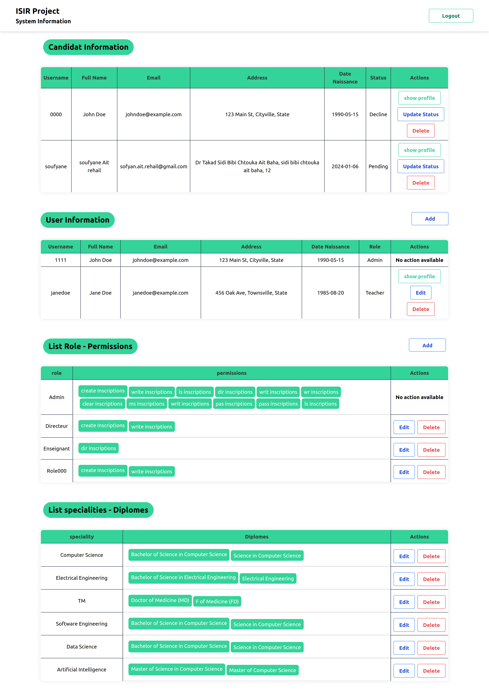
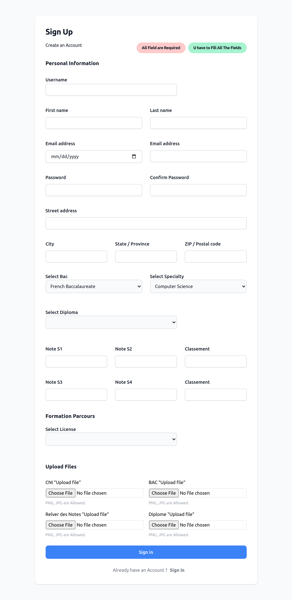
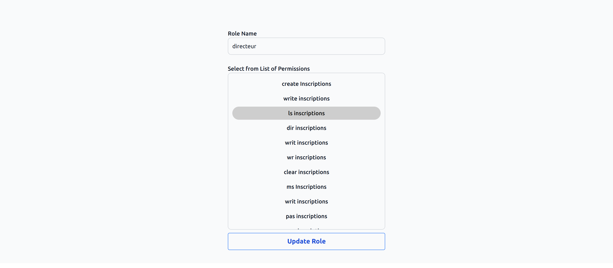
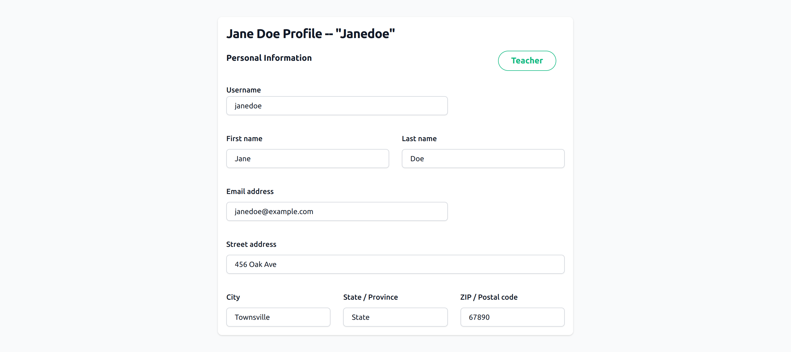
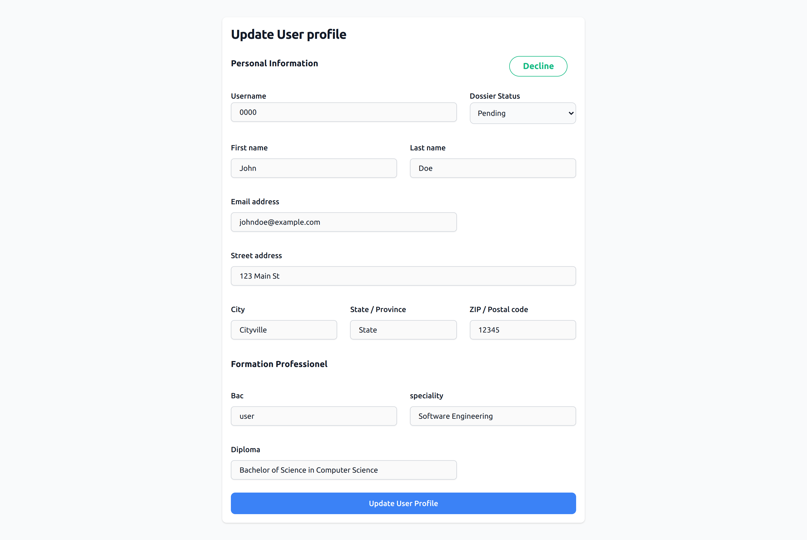

<h3 align="center">Dummy XML && PHP mini-project</h3>

    
    
  

[🔗 Report Registration System - "LaTeX"](https://www.overleaf.com/read/mvszgysqqtrm#9ba8e1)

|      |            |
| ------------------------------------ | --------------------------------------- |
|      |  |
|  |
